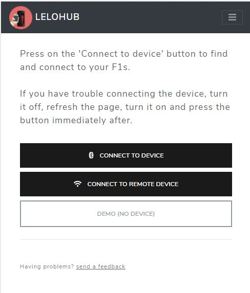
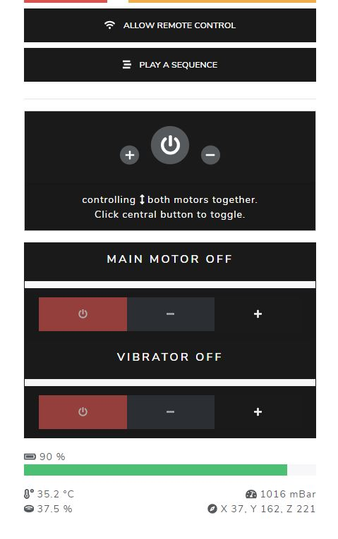
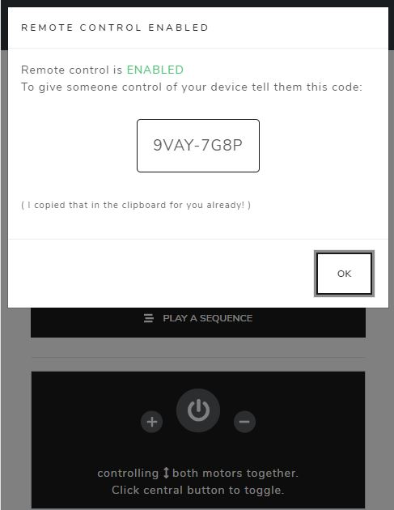
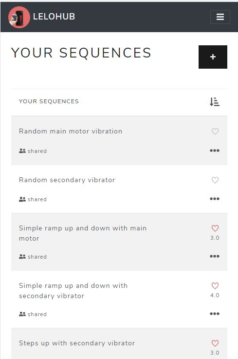
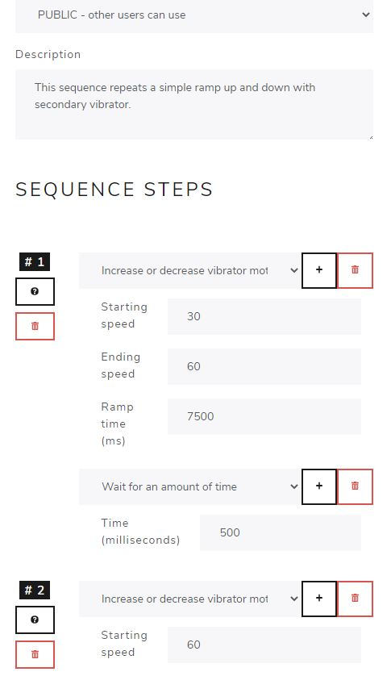
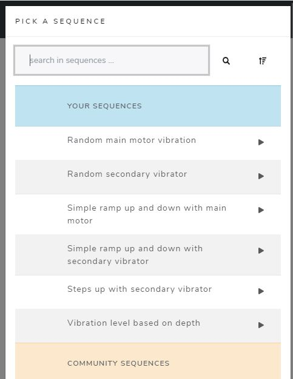
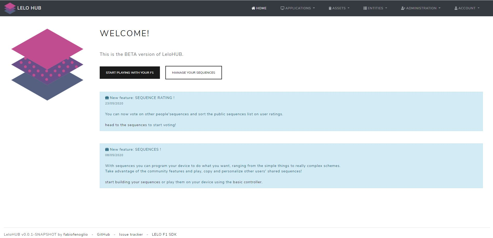
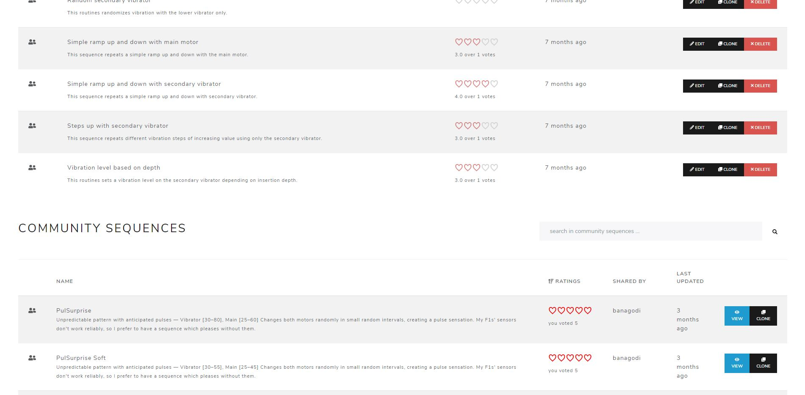
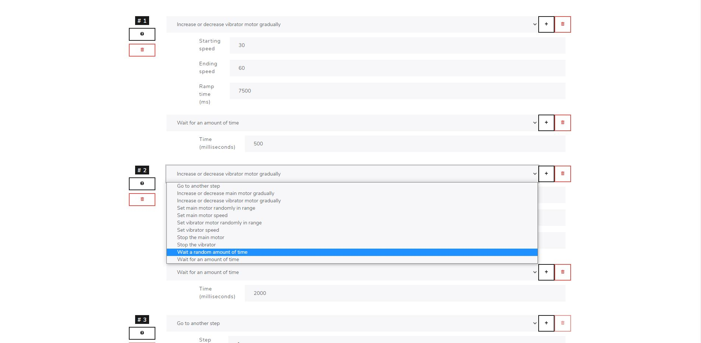
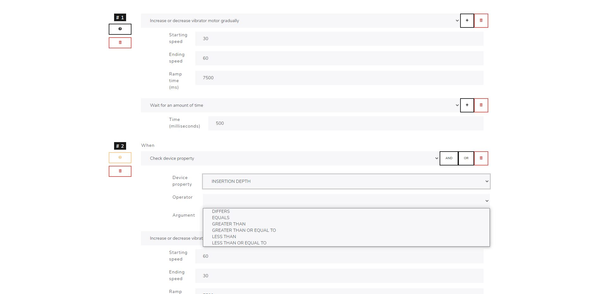

# LeloHUB

### WARNING: THIS PROJECT IS STILL NOT COMPATIBLE WITH THE NEWER VERSION OF THE DEVICE (F1S V2) AS BLE SPECIFICATIONS HAVE NOT YET BEEN RELEASED FROM THE PRODUCER.

The Hub is an unofficial project built around LELO's F1s (and F1S V2) devices.

It offers an alternative control panel with many features not available in the original app and works both on mobile and on desktop, like programmable patterns, sequences and remote control !

BETA Version of the site is available at [lelo-hub.fabiofenoglio.it](https://lelo-hub.fabiofenoglio.it/). 

Please note that it works using Web Bluetooth which is an emerging technology, currently supported by Chrome (both on desktop and on mobile) and Microsoft Edge browsers.
For more information on current and planned Web Bluetooth support refer to [caniuse.com](https://caniuse.com/web-bluetooth).

This repository hosts the documentation for the LeloHUB project.
Source code is currently private due to privacy reasons. It may however be published again once things are sorted out.

## Features

The HUB features:

- Basic control panel for the F1 SDK optimized for both desktop and mobile usage (on Chrome browser)
- Should work out-of-the-box with the new F1S V2
- Programmable custom sequences and patterns
- Community-shared, ready-to-use custom sequences and patterns
- Remote control to play with long-distance partners

## Screenshots (mobile)

</img> </img> </img> 

 </img>  </img>  </img>

## Screenshots (desktop)

</img> </img>

</img> </img>

## Support

Please open an Issue if something doesn't work or feels wrong. 

Any kind of feedback would be really appreciated.